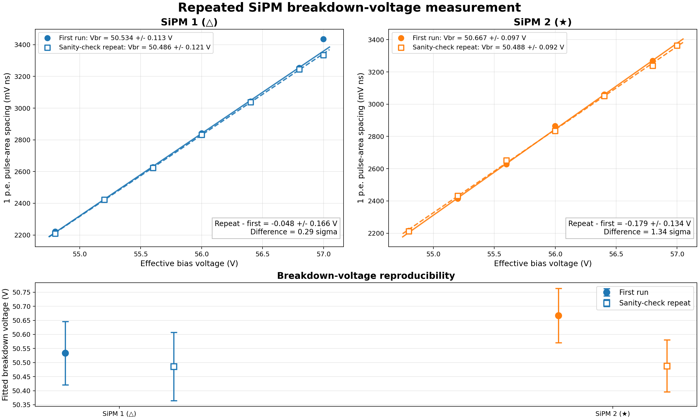

# SiPM Operating-Point Study

This repository records the work carried out to find a defensible operating point for the Hamamatsu **S13360-2050VE** SiPMs used with the gLOWCOST detector readout. The practical question sounds simple: what voltage should be applied to each SiPM? In practice, the answer depends on breakdown voltage, temperature, the analogue readout, the acquisition trigger, and the measurement used to compare one SiPM with another.

The work is kept here as a scientific record, including the measurements that worked, the measurements that did not work, and the reasons for changing the method. It covers the manual waveform recordings, height and area histograms, p.e. gap algorithms, channel-swap tests, high-statistics repeats, automated scans, pedestal studies, scintillator tests, and the later SiPM 1 (△) and SiPM 2 (★) measurements. Raw waveform files are too large for Git. The repository therefore contains the analysis code, compact processed data, selected plots, photographs, and an index pointing to the raw records on the acquisition computer.


## Present result

The two newly connected devices are identified throughout this study as **SiPM 1 (△)** and **SiPM 2 (★)**. Two clean scans were made after finding that the PCB CH3 path needed a 25 mV PicoScope trigger to avoid a low-amplitude trigger artifact.

| SiPM | Weighted breakdown voltage near 20.4 C | Internal uncertainty | Provisional setting for 3.0 V overvoltage |
|---|---:|---:|---:|
| SiPM 1 (△) | 50.512 V | 0.083 V | 53.51 V |
| SiPM 2 (★) | 50.574 V | 0.067 V | 53.57 V |

The measured difference is `0.062 +/- 0.106 V`, or `0.58 sigma`. The present data do not show a significant breakdown-voltage difference between these two devices.

These uncertainties describe the waveform analysis and run-to-run repeatability. They **do not include the absolute calibration uncertainty of the MAX1932/DAC bias system**. The settings above are therefore working values, not final traceable voltage calibrations. Equal overvoltage also does not by itself prove equal photon-detection efficiency or dark-count rate.



## How the study is arranged

| Start here | Contents |
|---|---|
| [Project overview](docs/01_project_overview.md) | Questions, scope, and the order in which the study developed |
| [Hardware and setup](docs/02_hardware_and_setup.md) | SiPM, readout, bias path, PicoScope, channels, and photographs |
| [Measurement method](docs/03_measurement_method.md) | Bias scan and scintillator zero-event procedures |
| [Analysis method](docs/04_analysis_method.md) | Baseline, pulse area, p.e. peaks, linear fit, and uncertainty |
| [Results](docs/05_results.md) | Original pair, later SiPM 1 (△) and SiPM 2 (★) measurements, failed checks, and interpretation |
| [Limits](docs/06_uncertainty_and_limits.md) | What the numbers do and do not establish |
| [Next measurements](docs/07_next_measurements.md) | Voltage calibration, temperature scans, and PDE matching |
| [Complete experiment history](docs/08_complete_experiment_history.md) | Every campaign from the first manual recordings to the repeat scans |
| [Waveform processing](docs/09_waveform_processing.md) | CSV structure, baseline, gates, height, area, acceptance, and saturation checks |
| [Peak finding and p.e. gap](docs/10_peak_finding_and_pe_gap.md) | The historical and final algorithms, equations, uncertainties, and failure tests |
| [Tools and reproducibility](docs/11_tools_and_reproducibility.md) | Hardware, software, package versions, file locations, and rerun procedure |
| [Figure and result catalog](docs/12_figure_and_result_catalog.md) | Where to find the important plots and what each one demonstrates |
| [Lab log](lab-log/README.md) | Chronological record of changes, observations, and decisions |
| [Data guide](data/README.md) | Processed files and raw-data locations |
| [References](docs/references.md) | Datasheet and analysis literature |

## Measurement chain


The p.e. spacing is used as a gain proxy. Above breakdown, it should increase approximately linearly with overvoltage. The fitted line is

```text
DeltaQ = m Vbias + b = m(Vbias - Vbr)
Vbr = -b/m
```

Pulse area is the primary observable because it uses the full pulse charge and is less sensitive than peak height to small changes in pulse shape and sample timing.

## Reproducing the analysis

The scripts are separated into [acquisition](scripts/acquisition), the current [analysis](scripts/analysis), and a [legacy method archive](scripts/legacy). The legacy scripts are kept because they show exactly how the early p.e. gaps were obtained; they are not silently presented as the final method. Example scan configurations are in [config](config). Install the Python dependencies with:

```bash
python3 -m venv .venv
source .venv/bin/activate
python3 -m pip install -r requirements.txt
```

The acquisition scripts expect the PicoSDK libraries on the waveform computer and SSH access to the Raspberry Pi controlling the bias. Paths and hardware addresses must be checked before a scan. The MAX1932 interface is write-only in this setup; a commanded value is not a direct voltage measurement.
