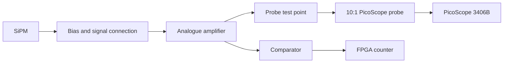
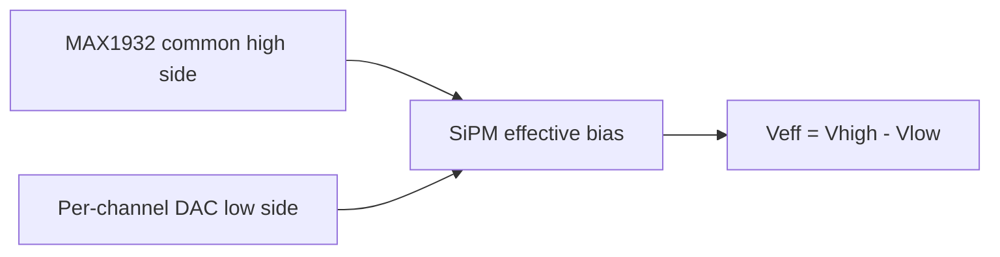
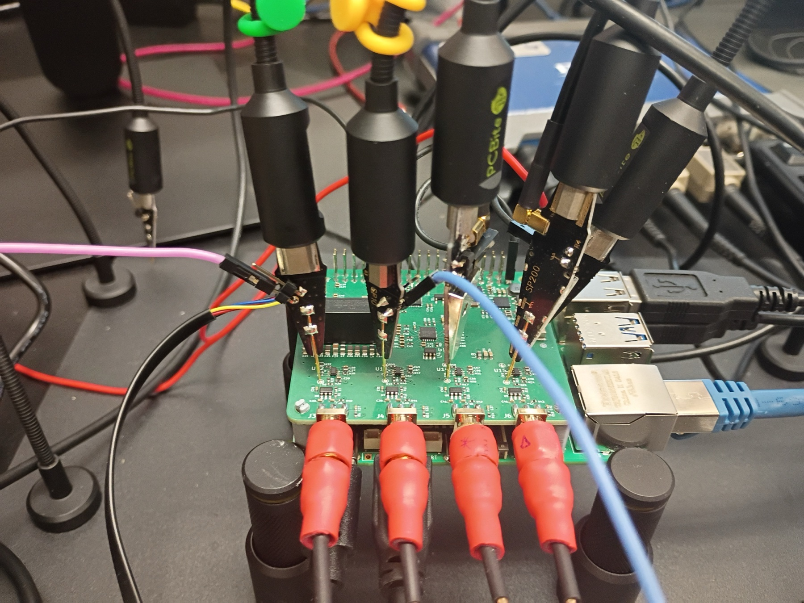
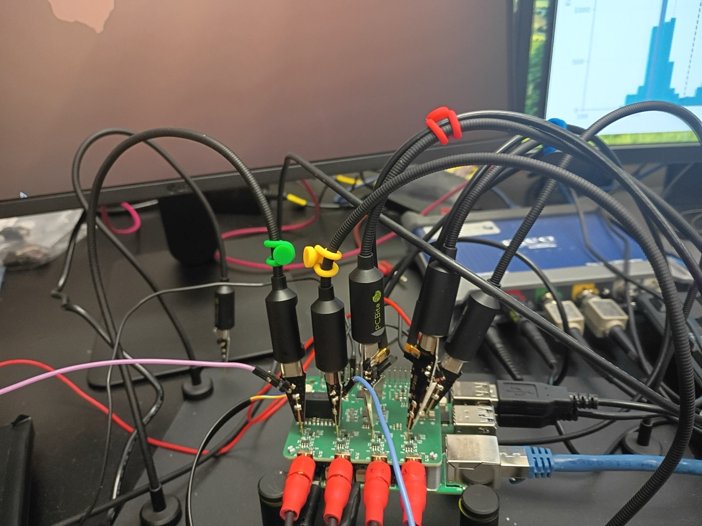
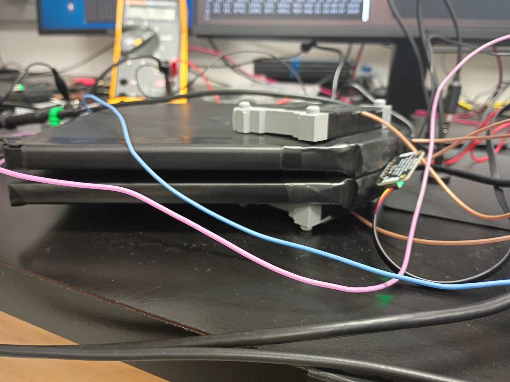
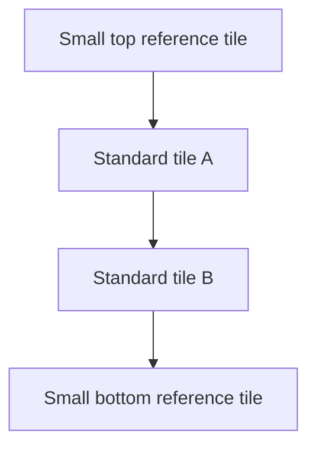

# Hardware and setup

## SiPM

The devices studied here are Hamamatsu **S13360-2050VE** MPPCs. The manufacturer's typical values at 25 C include a 2 x 2 mm photosensitive area, 50 um pixel pitch, 1584 pixels, a typical breakdown voltage of 53 V, and a typical gain of `1.7 x 10^6`. These are family values, not a substitute for measuring each device.

## Readout path

The waveform is measured after the gLOWCOST analogue amplification stage and before the comparator. The scope therefore sees the response of the SiPM together with the amplifier, coupling network, cable, probe, and digitizer.

The comparator and FPGA are part of normal detector counting, but they are bypassed for the waveform-based p.e. measurement. The PicoScope acquisition trigger is therefore not the same setting as the detector's threshold DAC.

## Bias path

The detector uses a common high side from the MAX1932 circuit and a channel DAC on the low side. The SiPM sees their difference.

The MAX1932 interface in the present hardware is write-only. The control program can report the value predicted by its calibration, but that report is not a direct high-voltage measurement. This distinction is important because the statistical uncertainty of the waveform fit can be much smaller than the uncertainty of the delivered voltage.

Temperature compensation was stopped for the controlled breakdown-voltage scans. Temperature was recorded and, where stated, values were normalized to 20 C using the provisional datasheet coefficient of 54 mV/C.

## Waveform instrumentation

- PicoScope 3406B
- 10:1 probes
- 1 ns sample interval for the main scans
- independent self-trigger on the channel being measured
- one active SiPM waveform channel at a time during the automated calibration
- HV-off pedestal runs before and after the original-pair scan

The 10:1 attenuation must be included when converting scope input values to the voltage at the probe tip. The capture code records the acquisition settings with each run.

The photograph above shows the four analogue paths being inspected. The Triangle and Star marks on the front connectors were used to preserve the identity of the two new SiPMs while scope channels and PCB channels were exchanged.

## Scintillator geometry used for the pilot

Two small scintillator paddles were used as reference counters above and below the standard tiles. Their coincidence selects particles passing through the central region. The standard tiles were read on the two remaining scope channels.

For that setup, scope channels C and D formed the reference coincidence. Channels A and B recorded the standard tiles. This arrangement measures the efficiency of the complete tile, fibre, SiPM, and readout chain for the selected particle sample.

## Channel identity

Channel identity was treated as experimental metadata, not inferred from color or scope position. This became necessary after deliberately swapping connections. The final clean Triangle/Star runs used:

| Physical SiPM | PCB channel | PicoScope channel | Acquisition trigger |
|---|---:|---:|---:|
| Triangle | CH3 | A | 25 mV |
| Star | CH2 | B | 25 mV |

These mappings apply to the final 2026-09-23 scans only.
