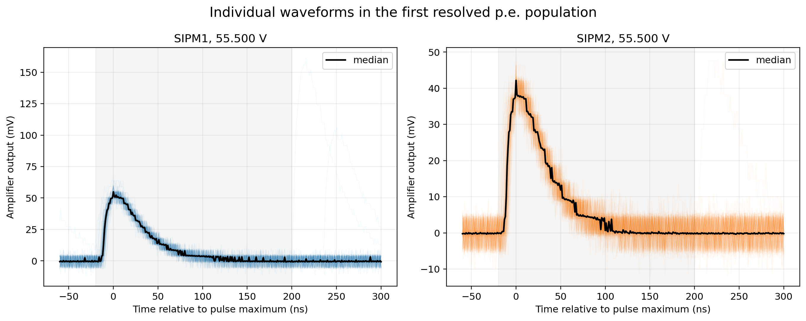
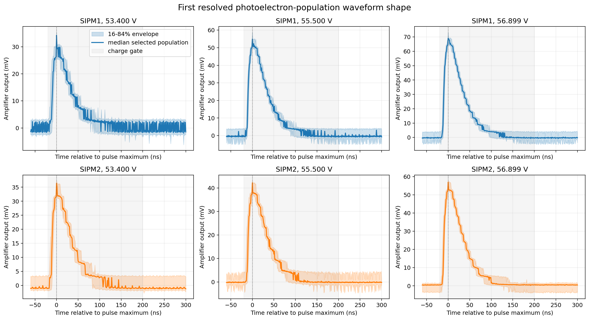
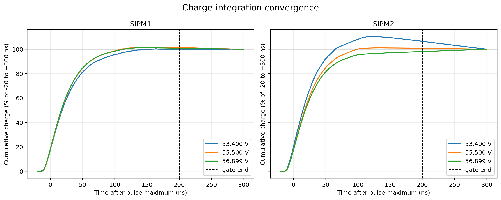
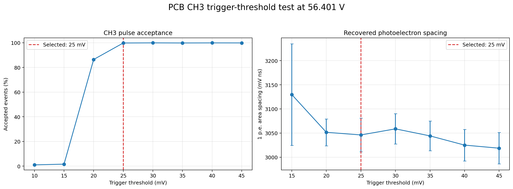
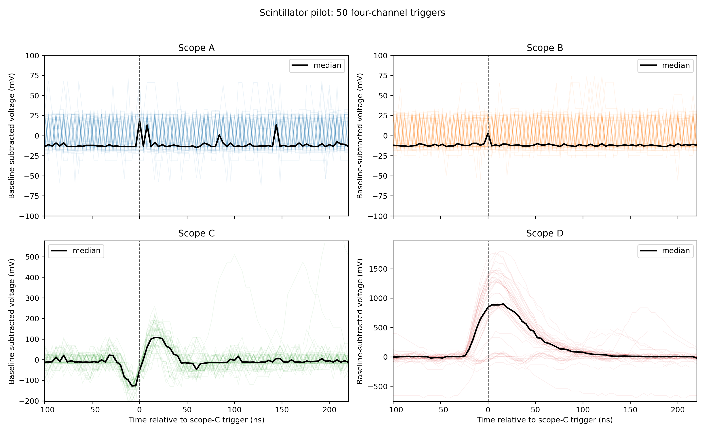

# Measurement method

## 1. Prepare the detector

Before a scan, the physical SiPM label, PCB channel, scope channel, and probe attenuation are written into the configuration. Temperature compensation is stopped so that the bias does not change while one voltage point is being recorded. The selected channel DAC is then used with the MAX1932 high side to reach the requested effective bias.

The hardware is allowed to settle at each point. The program records the requested voltage, control codes, temperature, trigger setting, sampling interval, event target, and file path. This metadata is as important as the waveform itself. A spectrum without its trigger and channel map cannot be used safely later.

## 2. Record the pedestal

With the high voltage off, the scope records the electronic baseline. This gives the noise distribution when no SiPM avalanche is present. Pedestal runs were taken before and after the original-pair scans so that drift could be checked.

The pedestal is not simply deleted from the data. Its mean and width constrain the zero-p.e. population in the spectrum model. This prevents the fit from moving the pedestal to a convenient but unphysical position.

## 3. Record dark-pulse waveforms

The SiPM is light blocked. Thermal carriers still produce avalanches, and optical crosstalk can produce pulses involving more than one microcell. These dark events form approximately equally spaced p.e. populations after amplification.

The main scans used 10,000 events at every effective-bias point. The PicoScope sampled at 1 ns. Each SiPM triggered independently on its own waveform. Independent triggering avoids assigning one channel's trigger timing to another channel's pulse.



## 4. Check the waveforms before fitting

The following checks are made before using a spectrum:

- accepted waveform count and trigger acceptance;
- baseline location and width;
- digitizer clipping or overflow;
- prompt pulse polarity and timing;
- pulse return toward baseline inside the record;
- stability of the extracted area when the integration gate is changed;
- agreement between area and peak-height behavior.





## 5. Bias scan

For each physical SiPM:

1. Set the effective-bias target.
2. Wait for the bias to settle.
3. Read and record the temperature.
4. Capture the requested number of waveforms.
5. Save the raw data and run metadata.
6. Move to the next voltage.
7. At the end, set the MAX1932 control to the HV-off value.

The scan covers a region where several p.e. populations are resolved. Points too close to breakdown may have too little separation, while points too high in bias may introduce saturation, crosstalk, or unnecessary stress.

## 6. Trigger acceptance check

A scope trigger can change the measured population. If it is too high, small avalanches are missed. If it is too low and the channel contains a prompt artifact, the scope repeatedly triggers on the artifact instead of the intended SiPM pulse.

This occurred on PCB CH3. At an effective bias of 56.401 V, acceptance changed from 1.62% at 15 mV to 99.82% at 25 mV. A trigger scan was therefore made before repeating the voltage scan.



The chosen 25 mV setting is the **PicoScope acquisition trigger**. It is not the threshold used by the detector comparator during normal counting.

## 7. Scintillator zero-event pilot

The reference coincidence is formed by the small top and bottom tiles. For every reference event, the standard tile waveform is checked for a pulse in the expected time window.

Let:

- `fd` be the zero-event fraction measured using dark/random gates;
- `fs` be the zero-event fraction in the scintillator signal gate.

The corrected probability of observing no scintillation response is

```text
P0(scintillator) = fs / fd
```

and the observed full-chain detection efficiency is

```text
efficiency = 1 - fs/fd
```

When a Poisson interpretation is suitable, the zero-event light estimator is

```text
mu_zero = -ln(fs/fd)
```



This method is useful for comparing complete detector channels. It is not an absolute SiPM PDE measurement because fibre coupling, scintillator light yield, geometry, and electronics are included.

## 8. Safe end state

Every automated scan should end by turning the high voltage off, including when the acquisition fails. The run manifest records the final state. The operator should still verify the measured high side because the MAX1932 command has no readback in the present circuit.
