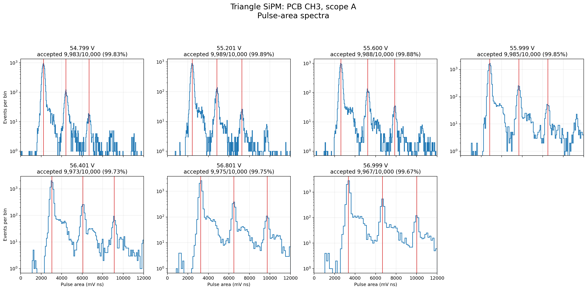
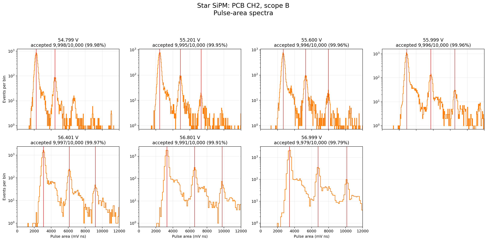

# Analysis method

This page gives the current primary method. The earlier smoothed-histogram and local-Gaussian method is documented separately in [Peak finding and p.e. gap](10_peak_finding_and_pe_gap.md), with its original scripts under `scripts/legacy/`.

## Why photoelectron spacing is useful

One fired SiPM microcell produces an avalanche with a charge proportional to overvoltage. Two simultaneously fired cells produce approximately twice that charge, and so on. A histogram of many dark pulses can therefore contain a pedestal followed by populations near 1 p.e., 2 p.e., 3 p.e., and higher.

The absolute position of the first visible population depends on the baseline and electronics offset. The **distance between neighboring populations** is more useful. It is a measure of the single-cell response after the readout chain.

## Baseline estimate

For every waveform, samples before the trigger are used to estimate the baseline. A sigma-clipped estimate is used instead of a plain average. The calculation begins with the pre-trigger samples, removes samples far from the central distribution, recalculates the centre and spread, and repeats until stable.

This reduces the effect of an early pulse or a short disturbance in the pre-trigger region. The baseline-subtracted waveform is

```text
v(t) = Vrecorded(t) - Vbaseline
```

The independent HV-off pedestal run is used to describe the zero-p.e. response and check drift.

## Peak alignment and pulse area

The prompt pulse maximum is found inside a restricted time region. The integration gate is placed relative to that maximum rather than at one fixed sample number. For the main analysis, the pulse area is integrated from 20 ns before the maximum to 200 ns after it:

```text
Qproxy = integral from (tpeak - 20 ns) to (tpeak + 200 ns) of v(t) dt
```

The result is expressed in mV ns. It is a charge proxy at the scope, not yet the SiPM charge in coulombs. Conversion to charge would require the transfer impedance and full analogue-chain calibration.

Peak height is also calculated, but it is kept as a cross-check. Area is the primary quantity because a slightly broader pulse can have the same charge while giving a different maximum sample.

## Building the spectrum

The accepted pulse areas are placed into a histogram. The display bins are not the fit model. They are a visual representation of the sample. The fit uses a pedestal-constrained sequence of Gaussian p.e. populations with a smooth background where required.

The centre of population `n` is described by

```text
mu_n = mu_0 + n DeltaQ
```

where `mu_0` is the pedestal position and `DeltaQ` is the p.e. spacing. A common spacing is fitted across the visible populations. The amplitudes and widths are allowed to describe the measured spectrum rather than forcing every peak to have the same number of events.

The fitting code uses SciPy optimization routines. Diagnostic smoothing can help locate candidate peaks, but the final spacing is obtained from the spectrum model, not from the smoothed curve alone.





## Quality tests

A converged fit is not automatically accepted. The analysis checks:

- sufficient trigger acceptance;
- more than one resolved population;
- preference for the comb model over a single broad population;
- stable spacing from different starting values;
- sensible adjacent-population separation;
- no fit parameter trapped on a boundary;
- consistency with the trend at neighboring bias points;
- absence of digitizer saturation.

This is why several lower-bias results were retained as diagnostics but excluded from the breakdown-voltage fit.

## Breakdown-voltage fit

The SiPM gain is approximately proportional to overvoltage in the measured operating region:

```text
DeltaQ = Ccell Greadout (Vbias - Vbr)
```

The unknown cell capacitance and readout conversion are combined into the slope. Written as a straight line,

```text
DeltaQ = m Vbias + b
```

therefore

```text
Vbr = -b/m
```

The x-axis intercept is not found by claiming that a visible pulse has zero height at breakdown. It is the extrapolation of the measured **gain spacing** to zero. Below breakdown, Geiger avalanches and the resolved p.e. comb disappear, so the line is fitted above breakdown and extended back to the intercept.

## Temperature normalization

Breakdown voltage changes with temperature. Where normalization is stated, each effective-bias value is shifted to a 20 C reference using the provisional coefficient `54 mV/C`:

```text
Vbias(20 C) = Vbias(T) - 0.054 (T - 20 C)
```

This coefficient is taken from the device-family information and is not yet an individual-device calibration. A dedicated temperature scan is still required.

## Uncertainty

The p.e. spacing uncertainty comes from the spectrum fit. A weighted line fit then propagates the slope-intercept covariance into `Vbr = -b/m`. If the points scatter more than their fit errors predict, an additional vertical scatter term is included so that the uncertainty reflects that dispersion.

Independent scans are compared point by point. Their Vbr values are combined with inverse-variance weighting only when the setup and analysis are compatible. This gives the internal repeatability uncertainty.

The following uncertainties remain separate:

- absolute MAX1932/DAC voltage calibration;
- probe and analogue-chain calibration;
- uncertainty in the temperature coefficient;
- channel-dependent trigger response;
- possible device heating and temperature gradients.

The distinction is important: the reported internal uncertainty answers how precisely this dataset fixes the intercept under the stated method. It does not answer how accurately the commanded MAX1932/DAC setting equals the physical SiPM voltage.

For this reason, a Vbr value may have a small internal fit error while still needing a larger absolute-voltage systematic.

## Why a good R2 is not enough

With a small number of selected points, even a biased measurement can lie on a straight line. A high R2 says that those points are linear; it does not prove that the trigger recorded an unbiased pulse population or that the voltage is absolutely calibrated. Acceptance, spectrum shape, repeated scans, channel swaps, and physical plausibility must support the fit.
