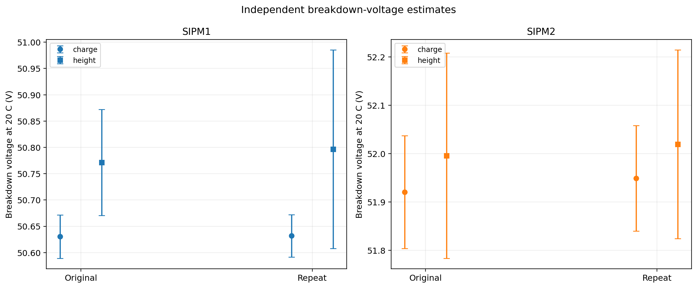
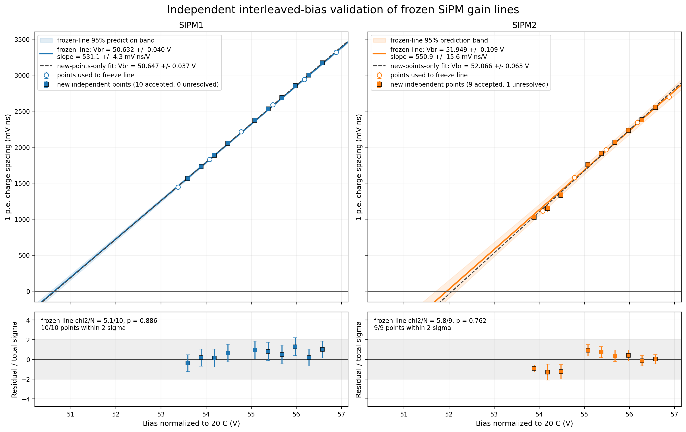
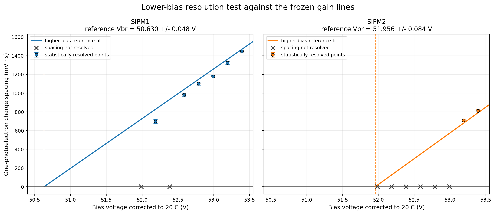
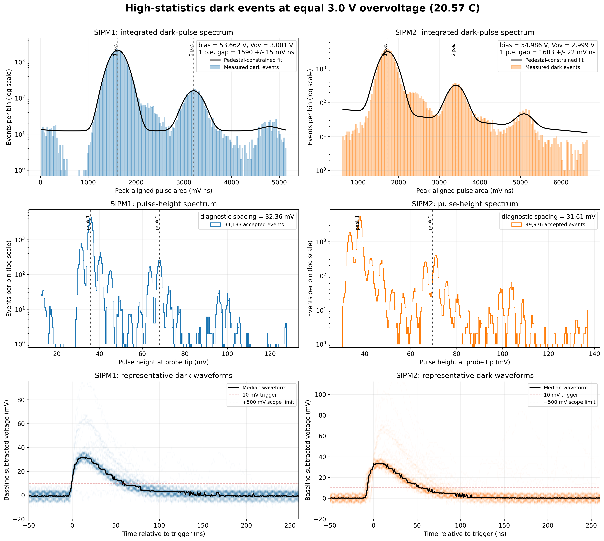
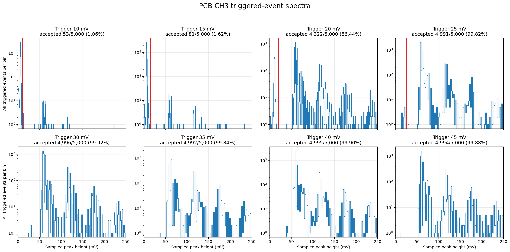
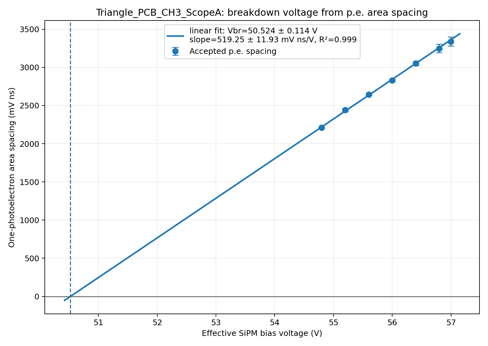
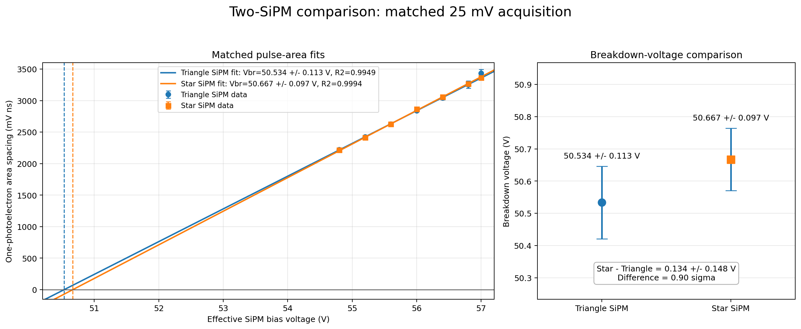
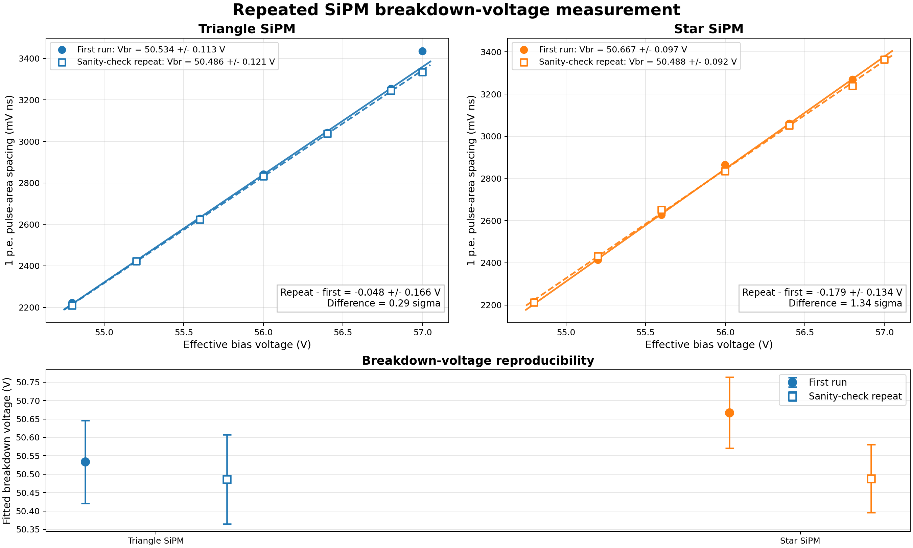

# Results

## 1. Original SiPM pair

The original SIPM1 and SIPM2 were measured in three independent scans. Each main scan used six bias points from 53.4 to 56.9 V and 10,000 waveforms per SiPM per point.

| SiPM | Vbr at 20 C | Internal uncertainty | Area-spacing slope | R2 |
|---|---:|---:|---:|---:|
| SIPM1 | 50.637 V | 0.037 V | 532.5 mV ns/V | 0.9997 |
| SIPM2 | 51.988 V | 0.103 V | 555.9 mV ns/V | 0.9976 |

The quoted errors are internal waveform-analysis errors. The common absolute voltage-calibration uncertainty has not been added.

An interleaved scan tested new voltage points against the lines fitted earlier. The new points were compatible with the frozen trends:

| SiPM | Frozen Vbr | Interleaved result |
|---|---:|---:|
| SIPM1 | 50.6318 +/- 0.0404 V | 50.6466 +/- 0.0374 V |
| SIPM2 | 51.9487 +/- 0.1093 V | 52.0662 +/- 0.0633 V |

### Lower-bias check

A separate scan covered 52.0 to 53.4 V in 0.2 V steps with a 10 mV scope trigger. The continuous stable regions were:

| SiPM | Stable region in the lower-bias scan |
|---|---|
| SIPM1 | 52.6 to 53.4 V |
| SIPM2 | 53.2 to 53.4 V |

Points below these regions either had too few accepted events, overlapping populations, initialization-dependent fits, or disagreement with the well-resolved high-bias trend.

Adding every apparently resolved low-bias point did not improve the measurement. For SIPM1 it moved Vbr from 50.630 to 50.800 V and increased the required intrinsic charge scatter from 7.9 to 25.5 mV ns. This behavior is evidence of low-end selection bias, not extra precision.

### Dark run at provisional operating points

The original pair was set near `Vbr + 3 V` at a mean temperature of about 20.57 C:

| SiPM | Effective-bias setting |
|---|---:|
| SIPM1 | 53.662 V |
| SIPM2 | 54.986 V |

Fifty thousand waveforms were acquired for each device. The p.e. spacing remained reproducible, but the acquisition throughput was limited by storage and readout. These data are not a calibrated dark-count-rate measurement.

## 2. New Triangle and Star pair

### Finding the PCB CH3 trigger problem

The Triangle SiPM initially produced only about 1 to 2.5% valid captures through PCB CH3 at a 15 mV scope trigger. Swapping the scope inputs did not move the behavior; it stayed with the PCB channel. This indicated a channel-path effect rather than a property of the scope input.

At 56.401 V, the trigger acceptance was:

| Scope trigger | Acceptance |
|---:|---:|
| 10 mV | 1.06% |
| 15 mV | 1.62% |
| 20 mV | 86.44% |
| 25 mV | 99.82% |
| 30 to 45 mV | 99.84 to 99.92% |

The p.e. spacing was stable from 20 to 45 mV. A 25 mV trigger was chosen as the lowest tested point on the stable acceptance plateau. This corrected the acquisition; it did not remove the channel artifact from the hardware.

The corrected seven-point CH3 scan gave:

- `Vbr = 50.524 +/- 0.114 V` from pulse area;
- slope `519.25 +/- 11.93 mV ns/V`;
- `R2 = 0.99892`;
- combined acceptance `99.806%`.

### First clean two-SiPM scan

Both physical SiPMs were then measured with the same 25 mV acquisition trigger and matched voltage points.

| SiPM | Vbr | Internal uncertainty |
|---|---:|---:|
| Triangle | 50.534 V | 0.113 V |
| Star | 50.667 V | 0.097 V |

### Sanity-check repeat

The complete scan was repeated using 10,000 events at each of seven bias points. The temperature ranged from 20.365 to 20.462 C.

| SiPM | Accepted waveforms | Repeat Vbr | Area-spacing slope | R2 |
|---|---:|---:|---:|---:|
| Triangle | 69,860 / 70,000 | 50.486 +/- 0.121 V | 513.32 +/- 12.44 mV ns/V | 0.99988 |
| Star | 69,952 / 70,000 | 50.488 +/- 0.092 V | 515.68 +/- 9.40 mV ns/V | 0.99933 |

The repeat-to-first-run shifts were `-0.048 +/- 0.166 V` for Triangle and `-0.179 +/- 0.134 V` for Star. Neither shift reached 2 sigma. The mean absolute point-by-point change in area spacing was 0.66% and 0.59%, respectively.

Combining the two clean runs gives:

| SiPM | Weighted Vbr | Internal uncertainty |
|---|---:|---:|
| Triangle | 50.512 V | 0.083 V |
| Star | 50.574 V | 0.067 V |

The Star-minus-Triangle difference is `0.062 +/- 0.106 V`, or `0.58 sigma`. There is no statistically significant Vbr difference in the present data.

## 3. What the measurements show

The main result is that the pulse-area method is repeatable when the trigger acceptance is controlled and several p.e. populations are resolved. The new pair can provisionally be operated near 53.51 V and 53.57 V for 3.0 V overvoltage at about 20.4 C.

The measurements do not yet show that the devices have equal PDE, equal DCR, or equal response to the wavelength-shifting fibre. Those properties depend on more than breakdown voltage. The next comparison must use a common pulsed light field or a carefully defined particle-trigger sample.
