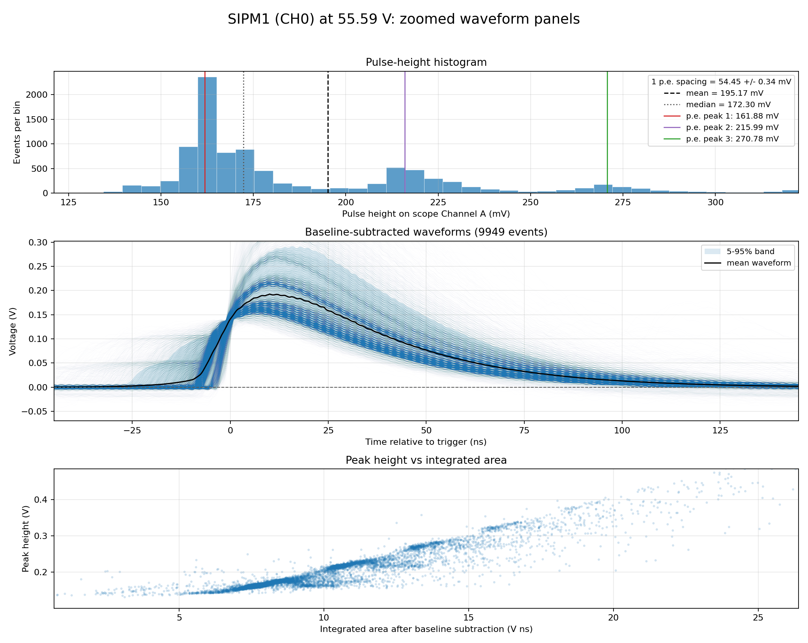
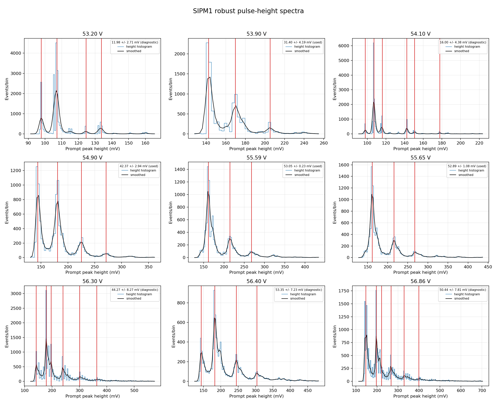
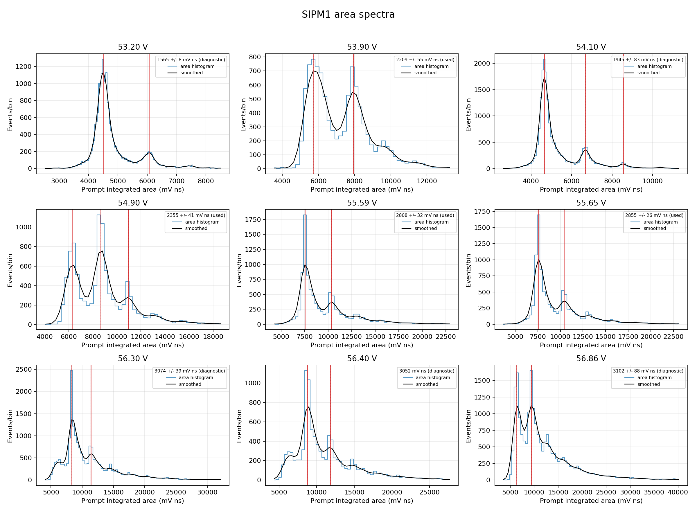
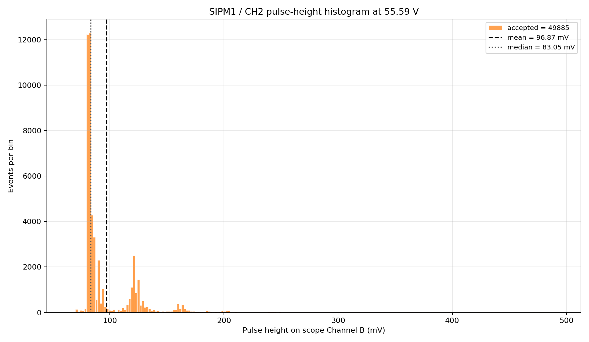
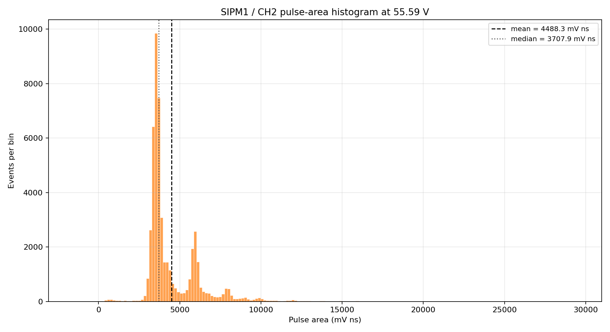
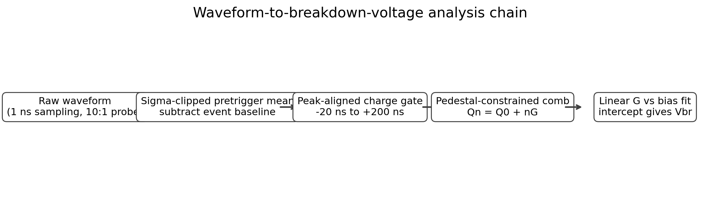
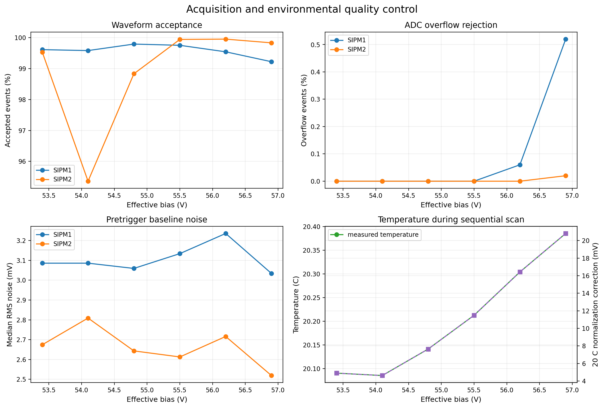

# Complete experiment history

This page records how the calibration developed. The dates matter because the method, channel mapping, trigger level, and number of events did not remain fixed throughout the study. Results from different periods should not be mixed without checking those conditions.

## 27 August: first manual bias series

The first question was simply whether the amplified dark pulses contained repeated photoelectron populations. PicoScope software captures were made for the original two SiPMs. SIPM1 was on PCB CH0 and SIPM2 was on PCB CH2.

| Bias | SIPM1 | SIPM2 | Nominal events |
|---:|---|---|---:|
| 53.90 V | CH0 | not recorded | 10,000 |
| 54.90 V | CH0 | CH2 | 10,000 each |
| 55.59 V | CH0 | CH2 | 10,000 each |
| 55.65 V | CH0 | CH2 | 10,000 each |
| 56.40 V | CH0 | CH2 | 10,000 each |
| 56.86 V | CH0 | CH2 | 10,000 each |

The first analysis calculated a baseline-subtracted peak height, a waveform integral, a peak-time distribution, baseline noise, and saturation diagnostics. A Gaussian-smoothed histogram was used to find candidate p.e. peaks. Local Gaussian fits refined their centers. The nearly even sequence of centers gave the provisional 1 p.e. gap.

The provisional height-gap line gave `51.55 +/- 0.30 V` for SIPM1 and `53.01 +/- 0.36 V` for SIPM2. Those values are preserved because they show what the first method produced. They were superseded after the baseline, prompt gate, trigger control, and area model were improved.

This stage established three useful facts. The amplified dark pulses did contain repeated populations; the gap increased with bias; and some high-amplitude traces approached the analogue or digitizer limits. It also exposed weaknesses: the mean pre-trigger baseline could move when a pre-pulse was present, a trigger-selected histogram did not contain an unbiased pedestal, and peak height changed when the pulse shape or sample timing changed.

The complete compact outputs from this period are in `data/processed/manual_campaigns/2026-08-27_55p59V_waveform_analysis/`.

The first all-voltage height-gap fit is retained in `data/processed/manual_campaigns/2026-08-27_initial_breakdown_analysis/`. It is part of the history, not the recommended final Vbr result.

## 31 August to 2 September: more voltages and channel swaps

The voltage coverage was extended with 53.20, 54.10, and 56.30 V records. Some captures used 20,000 events. Additional measurements moved the same physical SiPMs between PCB and scope channels at approximately 55.27, 56.45, and 57.867 V. The purpose was to separate a device effect from a channel or scope effect.

The processing was rebuilt from the raw CSV files. The baseline became an event-by-event median with median-absolute-deviation clipping. Only the prompt pulse was measured. A trace was accepted only when its prompt maximum was above the baseline noise requirement, inside the allowed time window, and not clipped.

The robust SIPM1 height analysis gave `51.448 +/- 0.217 V`, a slope of `12.612 mV/V`, and `R2 = 0.9929`. The corresponding available-point SIPM2 area analysis gave `52.035 +/- 0.342 V`, a slope of `646.308 mV ns/V`, and `R2 = 0.9603`. These were method-development results: the two devices were not yet being treated with one frozen, automated acquisition and analysis procedure.

The channel-swapped measurements were valuable checks, but they also showed why physical SiPM identity and electronic channel must be written separately. A clean-looking histogram with the wrong identity is not a useful calibration.

## 9 September: high-statistics repeats

The 54.90 and 55.59 V points were repeated with larger samples, including 50,000-event captures at 55.59 V. These runs were used to ask whether the small higher-p.e. populations became stable with more data and whether apparent shoulders were real neighboring populations or structure inside one population.

More events made small structures visible, but did not make every structure a valid p.e. peak. Some clusters contained shoulders or double maxima caused by waveform-shape variation, triggering, pickup, or a fit dividing one broad population. This was the reason for adding an even-spacing test instead of accepting every local maximum returned by `find_peaks`.

## 17 to 18 September: automated acquisition

The next problem was reproducibility. Manual PicoScope exports did not guarantee identical settings or complete metadata at every voltage. PicoSDK acquisition and Raspberry Pi bias control were therefore automated. Tests covered probe correction, scope range, trigger level, time sampling, software/PicoSDK agreement, and the bias-settle sequence.

The automated scan stored a manifest beside every voltage point. The analysis added acquisition-quality plots, pedestal characterization, height-versus-area checks, integration-gate variation, and leave-one-out breakdown fits.

## 19 to 21 September: repeatability and lower bias

The same bias points were repeated instead of assuming the first automated line was correct. Lower voltages were tested to find where the p.e. comb stopped being statistically resolved. This was an important distinction: a fitted number can be produced below the useful region, but it is not a measurement unless the multi-population model is supported by the spectrum.

The current lower-bias decision requires a strong preference for the comb over a single broad population, stable spacing from several initial values, separated neighboring populations, and no important parameter on a fit boundary. Points that failed remained in the record as unresolved.

The original pair gave internally precise, repeatable lines, but the absolute MAX1932/DAC calibration remained a separate uncertainty. That limits how strongly the numerical intercept can be compared with a datasheet value.

## 21 September: provisional operating point and dark counts

Each original SiPM was set close to its measured `Vbr + 3 V` point and a large dark-event sample was recorded. This checked what the selected operating point actually produced: resolved populations, event rates, waveform shapes, and any clipping. Equal overvoltage was treated as equal nominal gain condition, not proof of equal PDE or dark-count rate.

## 22 September: scintillator zero-event study

Two GSU gLOWCOST tiles were placed between two EPIC tiles. Four scope channels recorded the two GSU gLOWCOST-tile SiPMs and the upper and lower EPIC tiles. This was a trial of the zero-event idea with cosmic-ray scintillation instead of a pulsed LED.

The setup was useful for checking waveform accumulation, coincidence timing, and the response of the two GSU gLOWCOST tiles under a common EPIC-tile trigger. It was not a clean absolute PDE measurement. Cosmic energy deposition varies, light collection differs across the tiles, and the trigger does not deliver a fixed photon intensity. The LED-based zero-event method remains the correct next experiment for relative PDE matching.

## 22 to 23 September: SiPM 1 (△) and SiPM 2 (★)

Two new light-blocked SiPMs were connected to PCB CH2 and CH3 and identified as SiPM 1 (△) and SiPM 2 (★). Early scans were deliberately repeated with swaps and mapping checks. Several runs were rejected because the CH3 acquisition was dominated by a low-amplitude trigger population.

A trigger scan showed that the CH3 path required a 25 mV scope trigger for a physically useful spectrum. With that correction, both devices were scanned over 54.8 to 57.0 V, then scanned again independently.

| Result | SiPM 1 (△) | SiPM 2 (★) |
|---|---:|---:|
| First clean scan | 50.534 +/- 0.113 V | 50.667 +/- 0.097 V |
| Independent repeat | 50.486 +/- 0.121 V | 50.488 +/- 0.092 V |
| Weighted value | 50.512 +/- 0.083 V | 50.574 +/- 0.067 V |

The weighted difference is `0.062 +/- 0.106 V`, which is not statistically significant. These are internal values near 20.4 C. A common absolute bias-calibration systematic is not included.

## What changed from beginning to end

| Early practice | Current practice | Reason for change |
|---|---|---|
| Manual waveform export | PicoSDK scan with run manifest | Preserve settings and metadata |
| Mean pre-trigger baseline | Robust clipped event baseline | Resist pre-pulses and pickup |
| Whole or fixed waveform integral | Peak-aligned prompt gate | Compare the same pulse region |
| Peak height as main gain proxy | Integrated area as main proxy | Less sensitive to pulse shape and sample phase |
| Accept visible local maxima | Fit a constrained, nearly periodic p.e. sequence | Avoid counting shoulders as separate p.e. peaks |
| Fit error alone | Fit, run repeatability, gate variation, channel checks | Separate precision from reproducibility |
| Trust commanded HV | Keep absolute bias calibration as a systematic | MAX1932 command is not a voltage measurement |

## Raw campaign locations

The full waveform records remain under `/home/muon/brDownVstudy/experiments/` on the acquisition PC. The campaign-level paths and acceptance status are in `data/campaign_catalog.csv`. Git contains representative figures, compact tables, and the code required to understand each method.
