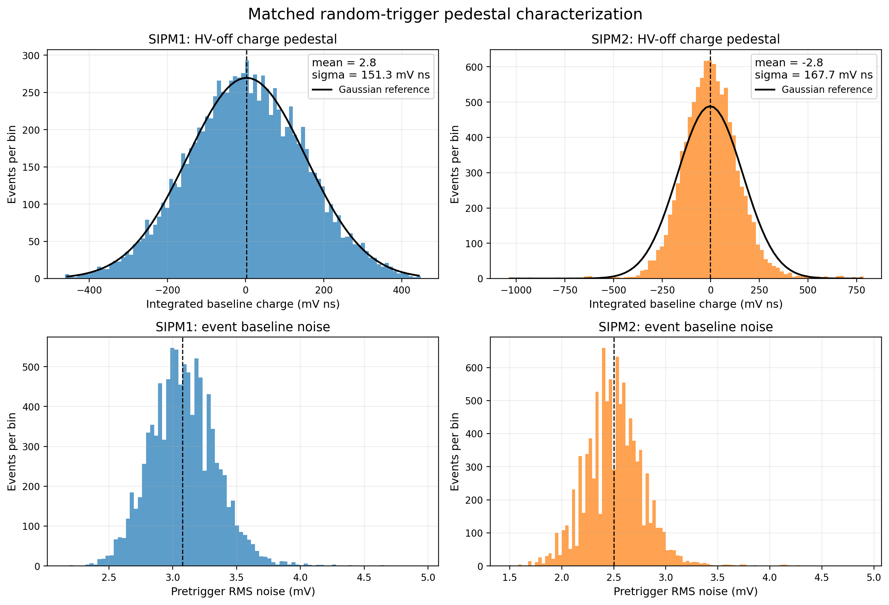
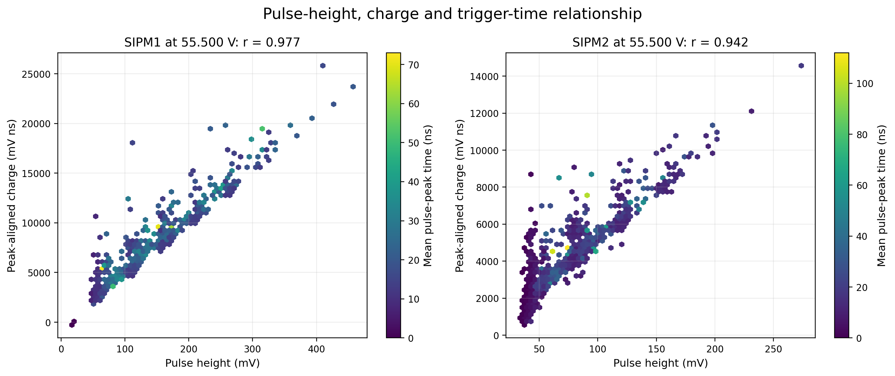
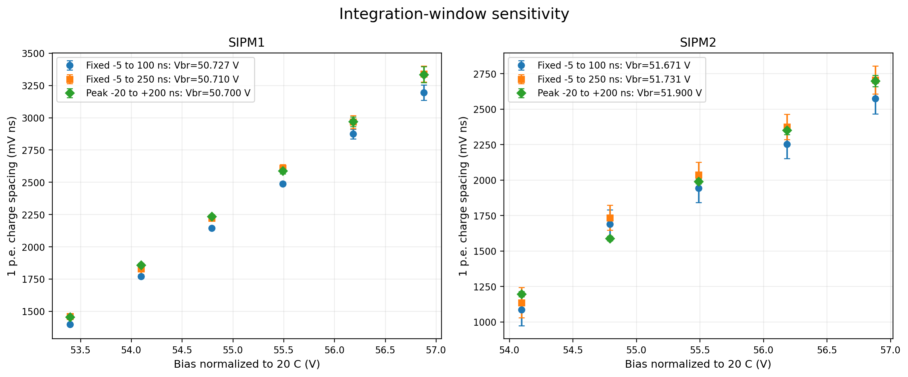
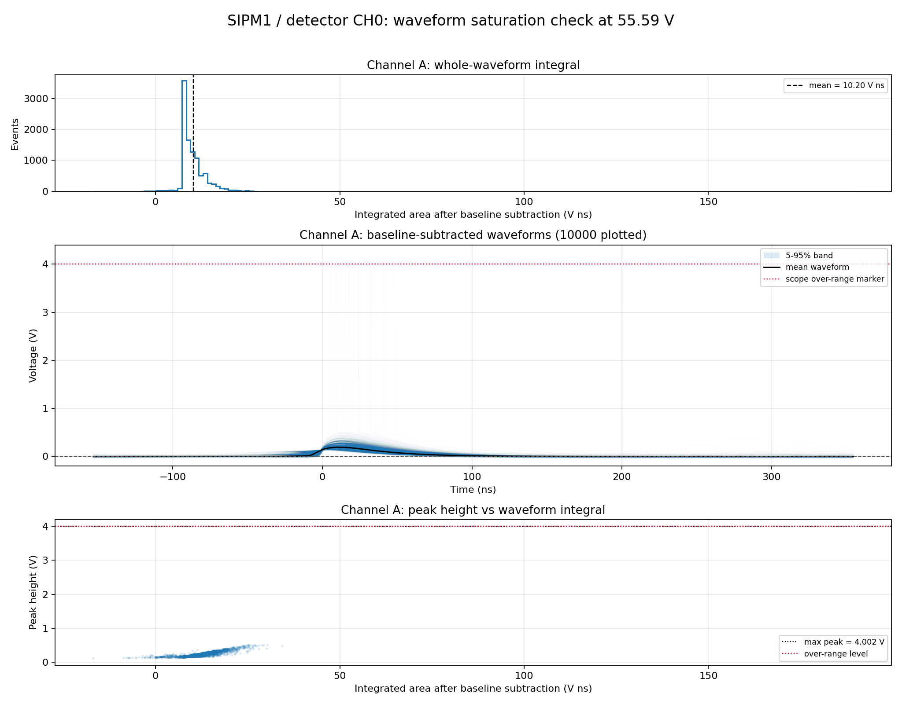

# Waveform processing

This page follows one waveform from the PicoScope CSV file to the two quantities used in the study: prompt peak height and integrated pulse area.

## Recorded waveform

Each event contains a shared time column and one or more scope-voltage columns. The probes were set to 10:1. The acquisition and analysis must agree on whether the CSV values are scope-input volts or probe-tip volts. Applying the factor twice changes the apparent gain by ten; omitting it changes it in the opposite direction. The probe correction is therefore recorded in the run configuration.

The waveform window includes a quiet pre-trigger region and the triggered pulse. A representative processed trace is

```text
voltage
  ^                         pulse tail
  |              /\___________
  |             /              \____
--+-------------+--------------------------> time
  | pre-trigger | prompt integration gate
                tpeak-20 ns       tpeak+200 ns
```

## Event-by-event baseline

Electronic offset is not exactly zero and can drift between events. The baseline is measured separately for each trace using samples before the pulse.

The early scripts used the arithmetic mean. The robust scripts first calculate the median and median absolute deviation:

```text
MAD = median(|xi - median(x)|)
sigma_robust = 1.4826 MAD
```

Samples far from the central baseline are removed, then the location is recalculated. The factor 1.4826 makes MAD comparable with the standard deviation for Gaussian noise. This method prevents one pre-pulse or pickup spike from moving the baseline of the whole event.

The corrected waveform is

```text
v(t) = Vrecorded(t) - Vbaseline
```

The code also stores baseline noise. A pulse must be larger than the noise requirement to be accepted.



## Prompt pulse location

The maximum is searched for only inside the expected prompt region. Searching the entire trace can select a late afterpulse or pickup transient. In the robust manual analysis, accepted maxima had to lie between approximately `-5 ns` and `80 ns`. The automated analysis uses the acquisition-specific search window from the run configuration.

For a sampled maximum, a three-point quadratic interpolation estimates the peak between ADC samples. This reduces the artificial step caused by the sampling grid. It does not invent extra detector information; it only estimates the vertex of the local parabola.

## Peak height

Peak height is the largest baseline-subtracted prompt voltage:

```text
H = max[v(t)] in the prompt search region
```

It is easy to understand and produced the first useful p.e. spectra. It is also sensitive to pulse width, ringing, exact sampling phase, and amplifier clipping. It remains a valuable independent cross-check.

## Pulse area

The main gain proxy is the baseline-subtracted prompt integral:

```text
A = integral from (tpeak - 20 ns) to (tpeak + 200 ns) v(t) dt
```

Numerically, the code uses trapezoidal integration. The unit is `mV ns`. This is proportional to charge after the analogue chain, but it is not yet coulombs. Calculating SiPM avalanche charge requires the calibrated transfer impedance and readout bandwidth.

Area is useful because two pulses with the same total charge can have slightly different maximum heights if one is broader. The height-versus-area plot checks whether the two measurements remain correlated and whether the amplifier or scope saturates.



## Why the gate follows the peak

A fixed gate tied to the trigger sample can lose the beginning or tail when trigger timing moves. A peak-aligned gate follows the pulse. The integration-gate systematic was checked by changing the start and stop offsets and repeating the complete breakdown fit.



## Event acceptance

A waveform is rejected when one or more of the following applies:

- the pre-trigger region is missing or too short;
- the baseline estimate is not finite;
- the prompt maximum is outside the permitted time region;
- the pulse does not exceed the noise/trigger requirement;
- the waveform touches the digitizer or amplifier rail;
- the requested integration gate is outside the recorded window;
- the CSV is incomplete or its channel mapping is not known.

The accepted-event fraction is plotted against bias. A sudden change can mean that the trigger, rather than the SiPM gain, changed the recorded population.


## Saturation checks

Waveforms were overlaid and peak height was plotted against area. Saturation appears when peak height stops increasing while area continues to change, when many traces share the same flat maximum, or when samples accumulate at the scope rail.



Events affected by saturation cannot be used to measure a reliable p.e. gap. More events do not repair clipping; the analogue gain, scope range, or operating voltage must be changed.

## Pedestal is not the first triggered peak

The pedestal means the zero-avalanche response. A dark-pulse run triggered on the SiPM is deliberately biased toward nonzero pulses, so the smallest visible triggered peak is not automatically the pedestal. An HV-off or random-trigger acquisition is required to measure the zero-p.e. distribution directly.

The pedestal is useful for checking electronic noise and for constraining the p.e. comb. It is removed event by event before calculating pulse height and area, but its measured width still enters the interpretation of whether neighboring populations can be resolved.

## Output from one voltage point

The current point analysis writes:

- event measurements and acceptance flags;
- baseline and baseline-noise distributions;
- pulse-height and pulse-area histograms;
- fitted candidate peak centers and uncertainties;
- selected p.e. sequence;
- height and area gap estimates;
- waveform and saturation diagnostics;
- a JSON summary used by the voltage-line fit.

This separation is deliberate. A reviewer can inspect the event quantities and histogram before accepting the final line-fit point.
