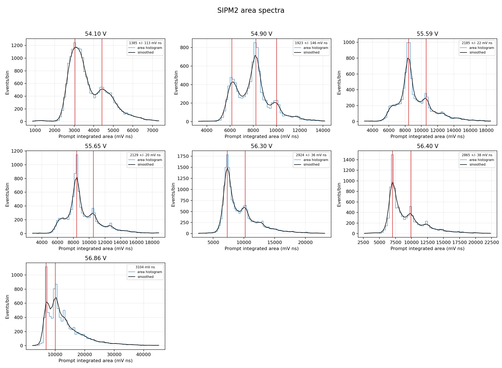
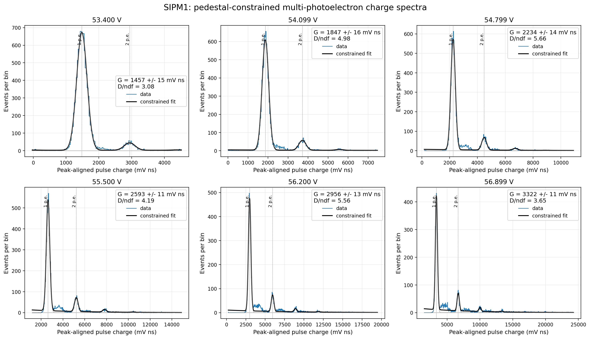
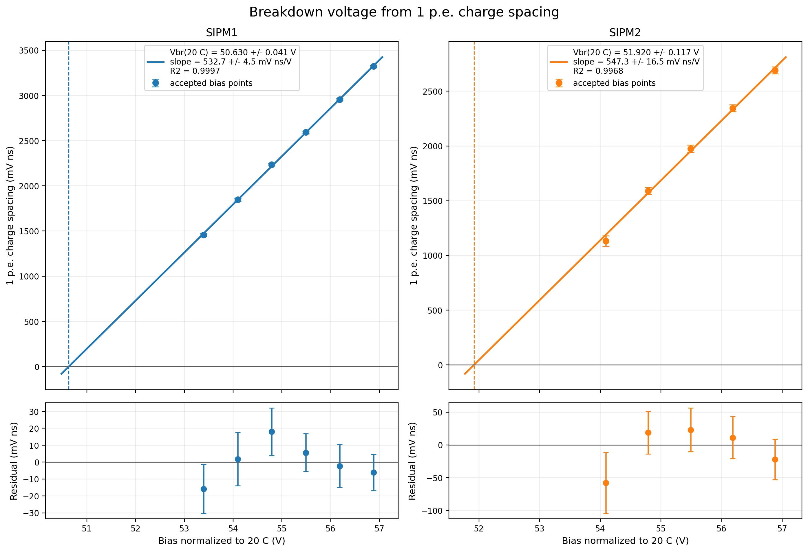
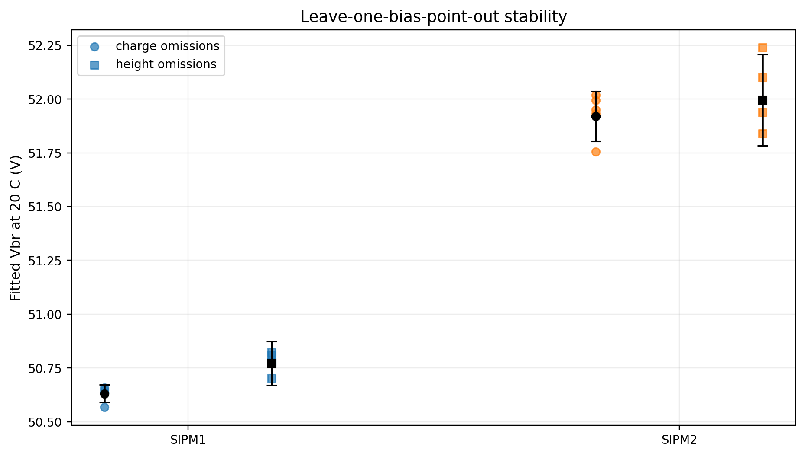

# Peak finding and p.e. gap

## Physical idea

One fired microcell gives one avalanche charge. Two fired cells give approximately twice that charge. After amplification, repeated populations can appear in a histogram:

```text
events
  ^             1 p.e.       2 p.e.       3 p.e.
  |               /\           /\           /\
  |      pedestal/  \         /  \         /  \
  |         /\  /    \_______/    \_______/    \
--+--------+--+------------------------------------> pulse area or height
           mu0      mu1          mu2          mu3

                 gap = mu(n+1) - mu(n)
```

The absolute position of a peak includes the baseline and electronics offset. The repeated distance between populations is the useful gain proxy. A physically valid sequence should be approximately periodic, not merely a list of local histogram maxima.

## Histogram binning

The raw event values are binned for display and for the historical peak search. Where an automatic width was needed, the scripts used data-dependent binning or a bounded width chosen from the sample spread. The histogram is a count representation, not a continuous measurement. A peak-center uncertainty cannot be smaller than the information allowed by the bin width, so the code includes a bin-width floor such as

```text
sigma_bin = bin_width / sqrt(12)
```

This is the standard uncertainty of a value known only to lie uniformly within one bin.

## Historical algorithm: smoothed candidate peaks

The first and robust manual analyses used this sequence:

1. Build the raw histogram of accepted peak heights or areas.
2. Smooth the bin counts with `scipy.ndimage.gaussian_filter1d`.
3. Find local maxima with `scipy.signal.find_peaks`.
4. Fit each candidate locally with a Gaussian plus a linear background using `scipy.optimize.curve_fit`.
5. Sort the refined Gaussian centers.
6. Search combinations of centers for the best nearly even sequence.
7. Calculate the mean adjacent-center difference and its uncertainty.

The Gaussian filter replaces each bin count by a weighted average of nearby bins:

```text
S(x) = sum H(xi) exp[-(x-xi)^2/(2 sigma_s^2)] / normalization
```

It suppresses one-bin statistical fluctuations and makes candidate maxima easier to locate. The smoothing curve was never meant to be new data. The raw bins were retained, and the peak centers were refined against the unsmoothed local histogram.

`find_peaks` used requirements on prominence and minimum distance. Prominence asks how far a maximum rises above its surroundings. Minimum distance prevents two nearby bins in one broad population from being counted as separate p.e. peaks.

The local model was approximately

```text
f(x) = A exp[-(x-mu)^2/(2 sigma^2)] + c0 + c1 x
```

`curve_fit` returned the center `mu` and its covariance. The sequence search then tested whether the selected centers followed

```text
mu_n = alpha + n Delta
```

where `Delta` is the p.e. gap.



## Why some maxima were not used

A small peak followed by a larger peak can be physically reasonable. Triggering can suppress the lowest-amplitude population, and optical crosstalk can move events from 1 p.e. into higher populations. Population height is therefore not the p.e. number.

The difficult case is a double maximum inside one expected population. Possible causes include pulse-shape variation, pickup, baseline error, two acquisition populations, or over-flexible peak finding. The analysis does not solve this by automatically calling every maximum a new p.e. peak. It asks whether the full selected sequence is evenly spaced and stable when the smoothing or initial values change.

At high bias, the expected p.e. gap is larger. Some historical scripts increased the minimum peak distance at high voltage to stop a shoulder inside one p.e. population from being counted twice. Those choices are visible in `scripts/legacy/`; they are kept for audit, not hidden.

## Current primary algorithm: pedestal-constrained comb

The final automated analysis uses pulse area and fits several p.e. populations together. Their centers share one spacing:

```text
mu_n = mu_0 + n DeltaQ
```

The zero-p.e. location and width are constrained by the independent pedestal information. Population amplitudes and widths can vary, so the fit does not require the 1 p.e. and 2 p.e. peaks to contain the same number of events.

The optimization uses `scipy.optimize.least_squares` with a Poisson-deviance residual appropriate for histogram counts. Several starting spacings are tried. A point is accepted only when the result is stable and the comb is preferred over a one-population smooth model.

The Bayesian information criterion is

```text
BIC = deviance + k ln(N)
```

where `k` is the number of fit parameters and `N` is the number of fitted bins/events used by the implementation. The study requires `Delta BIC >= 10` for the lower-bias comb check. This is strong evidence that the extra p.e. populations improve the description enough to justify their extra parameters.



## Resolvability tests

A spacing is reported as a measurement only when:

- at least two populations are supported;
- the comb fit converges from multiple initial spacings;
- the fitted spacing remains positive and away from parameter bounds;
- neighboring populations are separated relative to their widths;
- the comb is preferred by BIC;
- the result is compatible with neighboring bias points;
- acquisition acceptance and saturation checks are satisfactory.

A visible ripple is not sufficient. Conversely, a low-statistics spectrum can be unresolved even if the expected line predicts a small nonzero gap.

## Gap uncertainty

For the historical local-Gaussian method, each peak center has an uncertainty from the covariance matrix of its local fit, with a bin-width floor. The selected centers are fitted against integer p.e. index. The slope uncertainty is the p.e. gap uncertainty. In simpler historical summaries, the uncertainty was the standard error of the adjacent differences combined with the bin term.

For the comb method, the gap uncertainty comes from the local covariance/Jacobian of the simultaneous fit. It describes statistical precision under that model. It does not include absolute voltage calibration or every possible model error.

## Breakdown-voltage line

For each accepted bias point, the fitted gap is plotted against effective bias:

```text
DeltaQ = m Vbias + b = m(Vbias - Vbr)
Vbr = -b/m
```

The line is fitted with weights from the gap uncertainties. An uncertainty floor prevents a single unrealistically precise point from dominating. When the scatter exceeds the point errors, an intrinsic vertical scatter term is found numerically using `scipy.optimize.brentq` and included before refitting.

The covariance of slope and intercept is propagated to the x intercept. The analysis also repeats the fit while leaving out one voltage at a time. If the intercept moves strongly when one point is removed, the quoted regression error is not a trustworthy description of the result.





## Height and area are not expected to give identical slopes

Peak height is measured in mV and pulse area in mV ns. Their slopes have different units and depend differently on pulse shape. They should identify a compatible x intercept if the readout is linear and the accepted pulse population is stable. Agreement is a cross-check; forcing the two observables to have the same numerical slope would be incorrect.

## What the p.e. gap can and cannot tell us

The gap gives the readout response to one additional fired microcell. Its linear extrapolation gives an operational breakdown-voltage estimate. It does not by itself measure photon-detection efficiency, optical crosstalk, afterpulsing, or absolute avalanche charge. Those require additional measurements, especially a calibrated pulsed-light or zero-event study.
