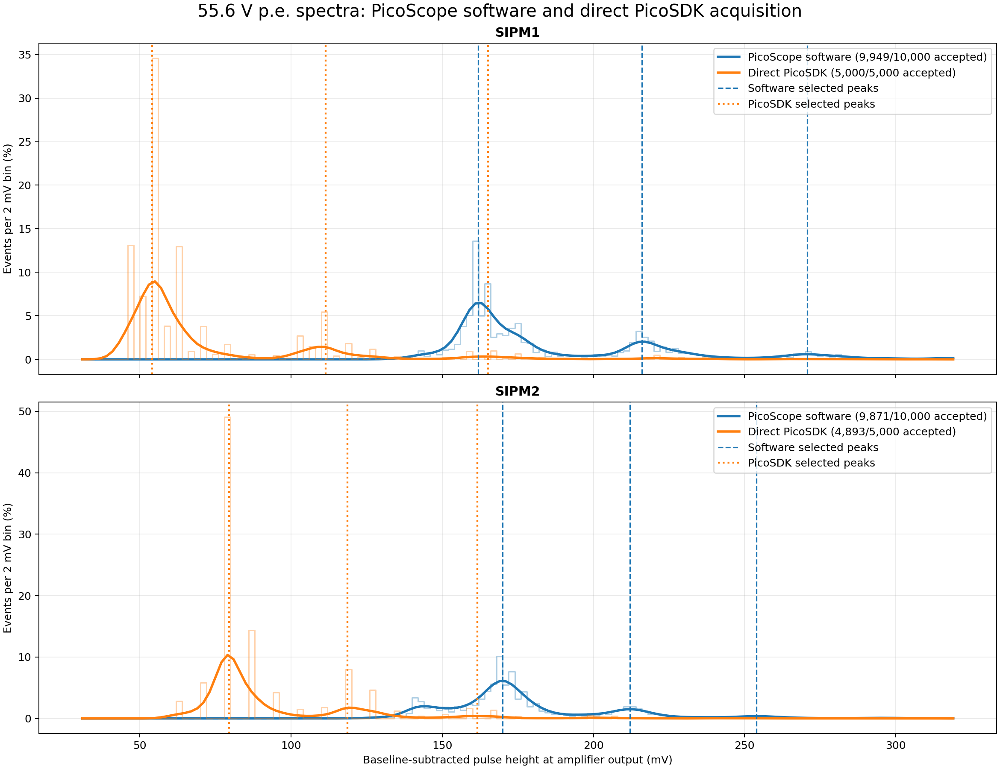
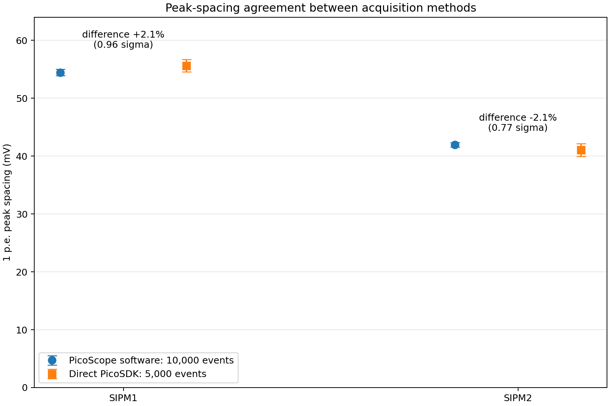

# Automation and first full scans: 2026-09-17 to 2026-09-18

## Aim

The manual procedure was converted into a repeatable scan controlled from the waveform computer. The program set the requested bias through the Raspberry Pi, recorded the environmental data, captured the PicoScope waveforms, and saved a manifest for every voltage point.

## Validation checks

- PicoSDK captures were compared with files saved by the PicoScope application.
- The 10:1 probe factor was checked in the voltage conversion.
- A 1 ns sample interval was selected for the main scans.
- Input range and clipping were inspected.
- Peak height and pulse area were calculated from the same baseline-subtracted waveforms.
- The pulse-area integration gate was varied to check convergence.

## First automated result

The p.e.-area spacing increased approximately linearly with effective bias for both members of the original pair. The fit provided a practical breakdown-voltage estimate, but two cautions were kept open:

1. the MAX1932/DAC model predicted the delivered bias without direct readback;
2. one clean scan could not establish repeatability.

## Decision

Freeze the analysis choices and repeat the experiment independently. New points should also be interleaved with the old voltage range to test the fitted line rather than only refitting the same settings.

## Raw records

- `/home/muon/brDownVstudy/experiments/2026-09-17_to_18_automation_validation/`
