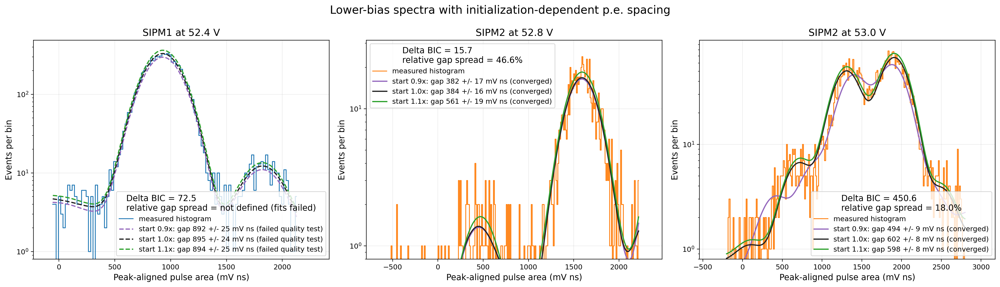

# Repeatability, low-bias tests, and operating points: 2026-09-19 to 2026-09-21

## Repeat scans

The original SiPM pair was scanned again with the same waveform method. Interleaved validation points were also compared against the previously frozen gain lines. The independent scans agreed within their internal uncertainties.

The combined three-scan values at 20 C were:

| SiPM | Vbr | Internal uncertainty |
|---|---:|---:|
| SIPM1 | 50.637 V | 0.037 V |
| SIPM2 | 51.988 V | 0.103 V |

The precision is internal to the waveform analysis. No absolute HV-calibration uncertainty is included.

## Lower-bias experiment

The bias was scanned from 52.0 to 53.4 V in 0.2 V steps. Ten thousand events were recorded for each SiPM at every point with a 10 mV scope trigger.

The expectation was that points closer to breakdown might constrain the intercept. Instead, the scan showed the resolution boundary of the apparatus. The stable regions started at 52.6 V for SIPM1 and 53.2 V for SIPM2. Below these values, the accepted sample became small or the neighboring populations overlapped strongly.

The low points were not added to the final Vbr values. Their disagreement and extra scatter would have produced a more precise-looking but more biased result.

## Provisional operating-point run

The two devices were set near their individual `Vbr + 3 V` values. Fifty thousand dark-triggered waveforms were recorded per SiPM at approximately 20.57 C.

The extracted p.e. spacings agreed with the earlier lines to about -0.34% for SIPM1 and +1.90% for SIPM2. This supported the gain calibration. It did not measure physical DCR because the stored-event rate was limited by readout and CSV writing, and the common trigger selected the two channels differently.

## Decision

Keep 3.0 V overvoltage as a provisional comparison point. Do not claim equal PDE or equal dark rate. Prepare a low-occupancy light test and, while waiting for the light source, test the full scintillator chain with reference tiles.

## Raw records

- `/home/muon/brDownVstudy/experiments/2026-09-21_breakdown_scan_method_development/`
- `/home/muon/brDownVstudy/experiments/2026-09-21_operating_point_dark_counts/`
